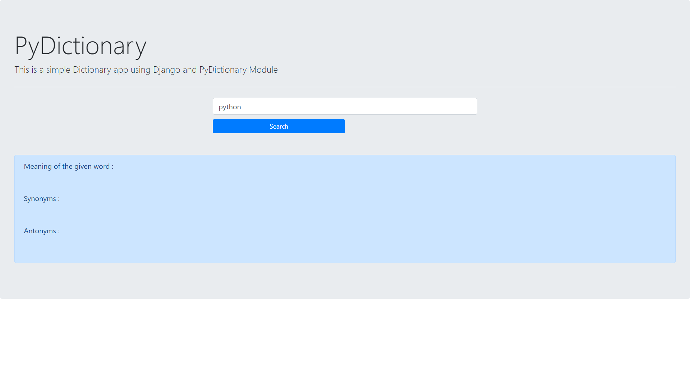

# Dictionary with Python/Django


Dictionary Web App made using Django and Pydictionary module in Python.
The dictionary app uses PyDictionary API which is a bit slow.

## How to?
```
>>pip install -r requirements.txt
>>python manage.py runserver
```

## The app will run on the local server

# Contributing
Any Issues and PRs are welcome
